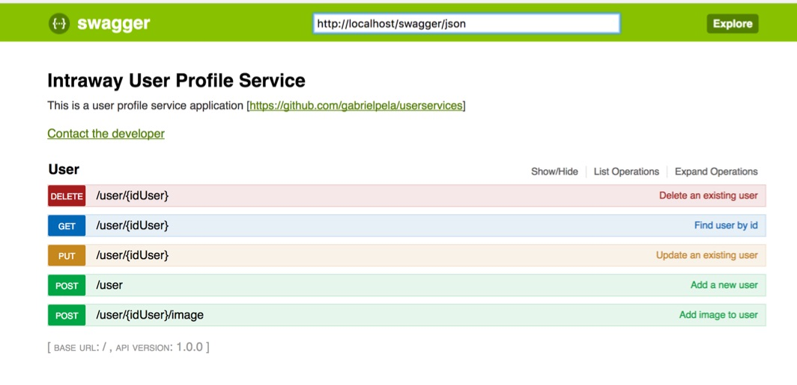

# UserService

UserService is a user profile service application

## Installation

```bash
$ git clone https://github.com/gabrielpela/userservices.git destination-folder
$ cd destination-folder
$ mysql --host=localhost --user=user-name -p db-name < ./doc/install-script.sql
```

UserService requires PHP 5.6.0 or newer.

## Apache configuration

Ensure your .htaccess and index.php files are in the same public accessible directory. 

Make sure your Apache virtual host is configured with the AllowOverride option so that the .htaccess rewrite rules can be used:

```bash
AllowOverride All
```

## Application configuration

The configuration data can be found in /config/settings.php

```php
 [
  'settings' => [
    'displayErrorDetails' => true,
    'logger' => [
      'name' => 'slim-app',
      'level' => 100,
      'path' => '/tmp/app.log',
    ],
    'db' => [
      'driver'    => 'mysql',
      'host'      => 'localhost',
      'database'  => 'dbname',
      'username'  => 'username',
      'password'  => 'password',
      'charset'   => 'utf8',
      'collation' => 'utf8_general_ci',
      'prefix'    => '',
    ],
    "pathRoot"     => $_SERVER["DOCUMENT_ROOT"],
    "pathUpload"   => '/resources/user/'
  ],
];
```


The images of the users will be saved in the directory "pathRoot" + "pathUpload" therefore it is necessary that the directory has read and write permissions

For example, if the directory is "/var/www/html/resources/user" you need to execute the following command:

```bash
$ mkdir -p /var/www/html/resources/user
$ chmod 755 /var/www/html/resources/user
```

## Documentation

UserService includes Swagger UI allows anyone to view and interact with API resources without having any logical implementation in place:

http://localhost/documentation/index.html



## Test

```bash
$ php ./vendor/bin/phpunit ./Tests/ServiceTest.php
```

You can also use the command:

```bash
$ php ./vendor/bin/phpunit ./Tests/ServiceTest.php http://localhost
```

where "http://localhost" is the base url where the application runs, by default the test is performed on "http://127.0.0.1"
